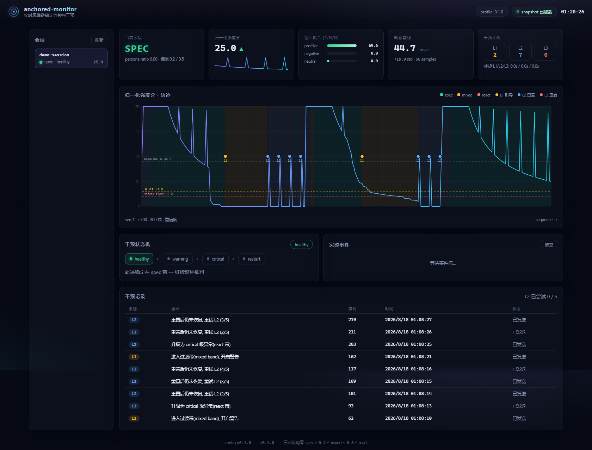

# dsh-anchored-monitor

[English](README.md) | **简体中文**

> **一句话说清（In one sentence）：这是给 DeepSeek V4 Pro 加的一根鞭子。**
> 当它从「We need / I will」这类高专注、高能力模式，跌落到「let me」这类
> 发散、低专注、低效率模式时，就抽它一鞭，让它改回去。
> When the model falls from the focused, high-capability mode ("We need…" / "I will…")
> into the scattered, low-focus mode ("let me…"), the whip cracks — and pulls it back.

> DeepSeek Harness 实时思维链锚定监控与干预插件。
> 持续监测每个 reasoning 块的 we / let's / let me 指纹, 让会话稳定在 spec 波段,
> 轨迹漂移时自动分级干预把模型拉回来。

[](https://www.npmjs.com/package/@a9i5k4/dsh-anchored-monitor)
[](https://github.com/Aik358/dsh-anchored-monitor)
[](LICENSE)
[](#环境要求)



---

## 为什么做这个

DeepSeek V4 Pro 强烈依赖**首轮请求**展示给它的内容来选择执行轨迹。社区实测:
官方 Minimal 预设(46 字符 persona + `bash`/`str_replace_editor` 双工具)锚定出
集体规划式 "we" 轨迹, Project2 得分 99/96; 而完整 Standard 预设锚定出行动者式
"let me" 轨迹, 得分只有 91。行为是**路径承诺的**: 一旦锚定, 之后即使扩展工具目录
最多扰动一个 reasoning 块, 思维模式不会自己翻转回来。

锚定类预设([dsh-anchored-standard](https://github.com/xiaobright/dsh-anchored-standard))
解决了"如何启动"。本插件解决**锚定之后**: 命令式提示、过长上下文注入等外部因素
会把轨迹拖出 spec 带, 此前没有任何机制能实时发现并修复这种漂移。

## 功能

- **实时指纹** — 每个 reasoning 块按 spec 轨迹词(we / let's / we'll / we need / our)
  与 react 指纹(let me)计分, 滑窗聚合。i will / i'll / i need 属规划标记, 归中性。
- **三波段模型** — 严格按 [dsh-router-standard](https://github.com/yjh051108/dsh-router-standard)
  实测量化: `persona_ratio < 0.2 → spec`, `0.2–0.5 → mixed`(不稳定过渡带),
  `≥ 0.5 → react`。
- **分级干预** — 自动触发、按级冷却、迟滞恢复:

| 级别 | 触发条件 | 动作 |
|------|----------|------|
| L1 引导 | 进入过渡带 | 注入**建议式**提示(严禁命令式——命令式会把 we 轨迹打回 let me) |
| L2 重置 | 进入 react 带 | **停掉当前回合并软重启对话**: 下一轮请求 persona 换回 46 字符 Minimal 句 + 仅 `bash`/`str_replace_editor`; 监控窗口与基线清零; 自动续跑任务 |
| L3 重启 | L2 重试次数超限 | 同 L2 软重启 + 注入「建议全新会话」提示, 不停在原地 |

- **液体毛玻璃 Web UI** — 左侧栏入口打开浮在对话上方的毛玻璃面板(可拖动/缩放/记忆位置);
  收起态变成**变阻器式悬浮条**: 思考强度即滑条位置, 附带日志滚动, 固定宽度圆角矩形(320px,
  视口自适应)不再忽大忽小。DeepSeek 白/灰/蓝主色调, 深色模式用与背景一致的中性灰;
  面板标题栏与设置页带**中/英切换**。
- **双皮肤** — 默认「严肃」变阻器条; 或「梗」皮肤(**滑动变祖器**): 小方块按思考强度
  从夯到拉切换梁文锋表情(卑微→帝服), 随波段脉冲发光。设置页一键切换(本地保存)。
  表情素材来自 [Lichtspektrum/liang-intensity-calibrator](https://github.com/Lichtspektrum/liang-intensity-calibrator)(MIT)。
- **零操作自动启动** — host 插件在 DSH 启动时自动拉起监控进程(15 秒看门狗保活), 用户无需任何操作。
- **实时流式心电图** — host 订阅 `llm/stream` 的 `reasoning-delta`, 按 1 秒节流实时推送:
  模型一边想, 图表与悬浮条一边跳(计数线性可加, 窗口聚合精确等价), 不再等整轮结束。
- **干预总开关** — 面板标题栏一键开关(持久化): 关闭=只监控不打断, 换模型后可随时关。
- **完整设置页** — 设置页内可调整全部技术参数(窗口/词典/评分权重/波段边界/阈值/冷却/
  提示模板/双工具/persona/日志轮转), 每项带解释文字, 底部浮动保存条, 保存后自动重启监控进程生效;
  图表只绘制**已启用规则**的阈值线, 不再误导。
- **环路内真实干预 + 自动续跑** — host 观测每个会话的 reasoning 并自动执行 L1/L2/L3, 且
  **打断后自动继续任务, 不停在原地**: L1 注入建议式上下文提示; L2/L3 取消当前回合
  (保留 inbox)并 followup 软重启续跑。
- **全配置化实验** — 词典、权重、阈值、窗口、波段边界、冷却全部在 YAML
  (`config/*.yaml`, 经 `config/schema.json` 校验)。JSONL 实验日志、离线回放、
  网格搜索校准脚本齐备。
- **完全解耦** — 监控是独立 Node 进程, 不占用模型算力, 不修改模型上下文。

## 环境要求

- Node.js ≥ 22.19
- DeepSeek Harness 0.1.0-rc.5+(Web 插件与 preset 需要)

## 安装

```bash
# 1) 把 Web 插件装进 web profile(dsh CLI 是 pnpm 转发器)
dsh plugin --profile web add @a9i5k4/dsh-anchored-monitor

# 2) 启动监控进程
npx anchored-monitor --profile demo

# 3) 重启 DeepSeek Harness(host bundle), 刷新 Web GUI
```

左侧栏底部出现「锚定监控 / Anchored Monitor」入口。点击打开玻璃面板;
点击悬浮条可展开/收起。修改监控地址: 编辑 `~/.dsh/anchored-monitor.json`
或 `POST /api/anchored-monitor/config` `{ "monitorUrl": "http://127.0.0.1:9301" }`。

## 快速演示

```bash
git clone https://github.com/Aik358/dsh-anchored-monitor.git
cd dsh-anchored-monitor
npm install && npm run build

npm run demo:generate                # 生成 300 个合成 reasoning 块
npm run dev -- --profile demo        # 监控进程 + 仪表盘(:9301)
npm run demo:feed                    # 实时投喂(观察 L1→L2 干预级联)
```

## Agent 侧 preset(可选)

把 `preset/` 复制到 `~/.dsh/.agent-presets/anchored-monitor`, 即可让 *harness agent*
在推理循环内推送自己的 reasoning 块并执行 L1/L2/L3 干预(建议与锚定类预设如
dsh-anchored-standard 配合完成首轮锚定)。

## API

监控进程(默认 `http://127.0.0.1:9301`):

| 方法 | 路径 | 说明 |
|------|------|------|
| GET | `/api/overview` | 会话 + 选中快照 + 尾部事件一次拿全 |
| GET | `/api/sessions` | 会话摘要 |
| GET | `/api/sessions/:id` | 完整快照(历史/干预/基线) |
| GET | `/api/events?sessionId=&limit=` | 实验 JSONL 尾读 |
| POST | `/api/push` | 推送 reasoning 块 `{sessionId, text, sequence?, timestamp?}` |
| POST | `/api/sessions/:id/ack` | 干预执行确认 |
| POST | `/api/sessions/:id/reset` | 手动 L2 重置 |
| GET | `/api/stream` | SSE 事件流 |

Web 插件经 `/api/anchored-monitor/*` 同源代理(loopback-only)。

## 脚本

| 命令 | 说明 |
|------|------|
| `npm run demo:generate` | 生成合成会话 JSONL(带 label, 供校准) |
| `npm run demo:feed` | 逐块投喂给运行中的监控进程 |
| `npm run replay -- --file x.jsonl` | 离线回放 + 统计摘要 |
| `npm run calibrate -- --file x.jsonl` | 网格搜索窗口/权重/阈值 |
| `npm run preview:build` | 把仪表盘快照成独立 HTML |

## 配置

完整参数手册见 [docs/experiment-params.md](docs/experiment-params.md)。
一切皆 YAML, 零硬编码策略。

## FAQ

**干预之后会怎样——对话会停在原地吗?**
不会。每次干预都自动续跑: L1 注入建议式提示后继续; L2/L3 停掉当前回合(软重启),
随即以 Minimal persona + 双工具的新条件重新注入上下文继续任务, L3 额外附重启建议。

**为什么之前心电图跳得慢/像卡住?**
0.2.0 之前数据只在每轮结束时推一次。现在 host 流式订阅 reasoning-delta,
每约 1 秒推送增量, 曲线在模型思考过程中持续跳动。

**怎么关掉干预?**
面板标题栏的「干预: 开/关」一键切换(持久化), 或设置里 `intervention.enabled: false`——
关闭后只监控不打断, 换模型后不再需要干预时用。

**L2 会截断模型上下文吗?**
不会。L2 只替换下一轮请求的 *persona 段*(46 字符 Minimal 句)并把可见工具目录
收缩到双工具; 对话历史全部保留; 监控进程清空的只是自己的指纹统计(模型不可见)。
plan-mode 等其他段原样保留——删掉它们会导致"重复探索仓库"式失忆(dsh-router-standard 实测)。

**为什么把过渡带当告警?**
mixed 带(0.2–0.5)是训练分布缺口: 实测得分低于任一稳定带。进入即触发 L1 建议式引导;
进入 react 带升级 L2。

**运行安全吗?**
监控进程对模型只读: 消费 reasoning 文本、发送干预信号。所有 HTTP 路由 loopback-only。
reasoning 文本可能含敏感信息, 实验日志默认本地落盘, 可在 `experiment_log` 关闭/轮转。

## 致谢

实现依据以下社区项目实测成果(浅克隆于 `../references` 供审计):

- [xiaobright/dsh-anchored-standard](https://github.com/xiaobright/dsh-anchored-standard) — 两阶段锚定预设(双工具、晋升门、晋升后常驻集)
- [ruler770525/dsh-anchored-flash](https://github.com/ruler770525/dsh-anchored-flash) — 指纹计数(`we`/`let's`/`let me`)与 E1/E1.5 措辞实验
- [yjh051108/dsh-router-standard](https://github.com/yjh051108/dsh-router-standard) — 双吸引子论文与三波段量化(`bandOf`)
- [KDB-Wind/dsh-minimal-anchored](https://github.com/KDB-Wind/dsh-minimal-anchored) — Minimal 工具锚定替代方案
- [Lichtspektrum/liang-intensity-calibrator](https://github.com/Lichtspektrum/liang-intensity-calibrator) — 「滑动变祖器」皮肤的梁文锋表情帧素材(MIT)
- [deepseek-ai/deepseek-harness](https://github.com/deepseek-ai/deepseek-harness) — 本插件扩展的宿主框架

## 插件作者注意(扩展前必读)

**流式瀑布规矩** — `llm/stream` 是"流透传"waterfall: 链上排在前面的监听器会直接
迭代排在它后面的监听器的返回值。因此:

1. **生产方**: `llm/stream` 监听器必须是**普通函数返回 async generator**;
   禁止写成 async 函数——async 会把 generator 包成 Promise, 上游 `for await`
   迭代时抛 `next(...) is not a function or its return value is not async iterable`。
2. **消费方**: 一律 `for await (const chunk of await next())` —— 先 await 再迭代,
   下游返回 Promise 或流都能安全透传(dsh-draw-gacha 已加该防御)。
3. `agent/pre-step`、`system-prompt/assemble` 属"值传递"事件,
   async + `await next()` 在那里是正确的。

违反一次 = 所有模型调用全部失败且会话不落任何事件; 若调 bundles 顺序或装新插件后
"所有会话突然全挂", 第一反应就查 `llm/stream` 链。

**单干预执行器原则** — L1/L2/L3 只允许一个执行者。Web 插件(host 半)是默认执行者;
agent preset(`preset/`)默认 `handleInterventions: false`, 只负责推送 reasoning。
两者同时开启会把 `agent/pre-step` / `system-prompt/assemble` 注册两份,
L2 重置执行两次、hint 重复注入。

## License

[MIT](LICENSE) © 2026 Aik358
